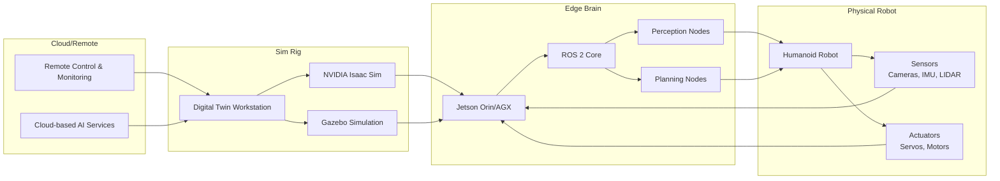

## Learning Objectives

After reviewing this chapter, you will be able to:
- Identify the hardware requirements for different Physical AI system components
- Compare different hardware configuration options based on performance and cost
- Understand the architecture connecting simulation, edge computing, and physical robots
- Evaluate cost-effective solutions for different budget constraints

## Introduction

This chapter provides comprehensive hardware requirements for implementing the Physical AI & Humanoid Robotics system. The requirements are organized into different configuration options to accommodate various needs, from simulation-only development to full physical robot implementation. Understanding these hardware requirements is essential for successful project execution, ensuring your system has the necessary computational power and components to run the complex algorithms discussed in this textbook.

The hardware specifications are designed to support the entire Physical AI stack, from ROS 2 communication to NVIDIA Isaac Sim simulation and OpenAI Whisper integration for voice commands. Different system configurations are provided to match various use cases and budget constraints.

## Digital Twin Workstation Requirements

For developers working with simulation environments like Gazebo and NVIDIA Isaac Sim, the following specifications are recommended to ensure smooth operation:

| Component | Minimum | Recommended | High Performance |
|-----------|---------|-------------|------------------|
| GPU | RTX 3060 (12GB) | RTX 4070 Ti (12GB) | RTX 4090 (24GB) |
| CPU | AMD Ryzen 7 5800X or Intel i7-12700K | AMD Ryzen 9 5900X or Intel i9-12900K | AMD Ryzen 9 7950X or Intel i9-13900K |
| RAM | 32GB DDR4-3200 | 64GB DDR5-4800 | 128GB DDR5-5200 |
| Storage | 1TB NVMe SSD | 2TB NVMe SSD | 4TB+ NVMe SSD RAID |
| OS | Ubuntu 20.04 LTS | Ubuntu 22.04 LTS | Ubuntu 22.04 LTS |
| Network | Gigabit Ethernet | Gigabit Ethernet + WiFi 6 | 10Gb Ethernet |
| PSU | 750W 80+ Gold | 850W 80+ Gold | 1000W+ 80+ Platinum |
| Cooling | Standard AIO | High-performance AIO or Custom Loop | Custom Liquid Cooling |

**Estimated Cost (USD)**:
- Minimum: $2,500
- Recommended: $4,500
- High Performance: $8,000+

## Physical AI Edge Kit Requirements

For running AI algorithms on humanoid robots in real-time, the following edge computing solutions are recommended:

| Component | Jetson Orin Nano | Jetson Orin NX | Jetson AGX Orin |
|-----------|------------------|----------------|-----------------|
| GPU | 40-64 CUDA cores | 1024 CUDA cores | 2048 CUDA cores |
| CPU | ARM Cortex-A78AE (4-core) | ARM Cortex-A78AE (8-core) | ARM Cortex-A78AE (12-core) |
| RAM | 4GB LPDDR5 | 8GB LPDDR5 | 32GB LPDDR5 |
| Jetpack SDK | 5.1 | 5.1 | 5.1 |
| Power | 7-15W | 10-25W | 15-60W |
| Dimensions | 100x100mm | 100x100mm | 100x100mm |
| Price | $400 | $600 | $1,200 |
| Sensors | - | - | - |

**Additional Required Sensors**:
- **Intel RealSense D435i**: RGB-D camera with IMU, $230
- **Seeed ReSpeaker 4-Mic Array**: For voice recognition, $70
- **9-axis IMU**: For balance and orientation, $45
- **Stereo Camera**: For depth perception, $150

**Total Kit Cost**: $1,125 (Orin Nano) to $2,125 (AGX Orin)

## Robot Lab Options

We provide three different robot lab configurations to accommodate different budgets and requirements:

### Option A: Unitree Go2 Edu
- **Type**: Quadruped Robot
- **Actuators**: 12 joints with high-torque motors
- **Sensors**: IMU, camera, LIDAR
- **Compute**: Onboard AI computer
- **Software**: ROS 2 compatibility
- **Price**: $28,000 per unit
- **Quantity**: 1-3 units recommended for classroom
- **Total**: $28,000-$84,000

### Option B: Unitree G1
- **Type**: Humanoid Robot
- **Actuators**: 23+ joints with precise control
- **Sensors**: Multiple cameras, IMU, force sensors
- **Compute**: Powerful onboard computer
- **Software**: ROS 2 compatibility
- **Price**: $160,000 per unit
- **Quantity**: 1 unit recommended for research
- **Total**: $160,000

### Option C: Hiwonder TonyPi Pro
- **Type**: Humanoid Robot
- **Actuators**: 32 servos (24 metal gear + 8 smart servos)
- **Sensors**: Raspberry Pi camera, microphone array, touch sensors
- **Compute**: Raspberry Pi 4 (8GB) with ESP32 coprocessor
- **Software**: Python-based SDK, ROS 2 compatibility
- **Price**: $3,200 per unit
- **Quantity**: 2-5 units recommended for classroom
- **Total**: $6,400-$16,000

## Architecture Summary

The following diagram shows how the different components of the Physical AI system connect:

## Cloud-Native "Ether" Lab Cost Calculation

For institutions looking to implement a cloud-native Physical AI lab, the following cost model provides an economical solution:

| Component | Quantity | Unit Cost (Monthly) | Monthly Cost | Annual Cost |
|-----------|----------|-------------------|--------------|-------------|
| High-performance VM (8 vCPU, 64GB RAM, A10 GPU) | 10 | $200 | $2,000 | $24,000 |
| Storage (1TB per student) | 10TB | $0.10/GB/month | $1,000 | $12,000 |
| Simulation licenses | 10 | $20 | $200 | $2,400 |
| Network & bandwidth | - | - | $300 | $3,600 |
| Management & support | - | - | $500 | $6,000 |
| **TOTAL** | | | **$4,000/month** | **$48,000/year** |

**Per student cost (quarter)**: ~$205 (for 20 students)

**Advantages**:
- No hardware maintenance
- Automatic updates and scaling
- Access from anywhere
- Shared resources optimization

## Economy Jetson Student Kit

For individual students or smaller programs, we provide a cost-effective Jetson-based kit:

| Component | Model | Function | Price (USD) |
|-----------|-------|----------|-------------|
| Computer | Jetson Orin Nano Developer Kit | Edge AI compute | $400 |
| Camera | Raspberry Pi Camera Module 3 (6MP) | Vision input | $50 |
| Microphones | ReSpeaker 4-Mic Array | Voice input | $70 |
| IMU | 9-axis IMU Breakout Board | Orientation & balance | $45 |
| Battery | 11.1V 5200mAh LiPo Battery | Power for 2-3 hours | $60 |
| Chassis | 3D printed robot frame | Structural base | $100 |
| Actuators | 20 Dynamixel XL430 servos | Robot joints | $600 |
| Power Management | DC-DC converters, power distribution | Power regulation | $75 |
| Cables & Connectors | Various cables and adapters | Physical connections | $50 |
| **TOTAL** | | | **$1,450** |

**Optional Add-ons**:
- Intel RealSense D435i: +$230
- Additional sensors: +$100-$300
- Custom end effectors: +$150-$400

## Further Reading

- [NVIDIA Jetson Product Comparison](https://www.nvidia.com/en-us/autonomous-machines/embedded-systems/jetson-orin/)
- [Unitree Robotics Documentation](https://unitree.com/)
- [ROS 2 Hardware Compatibility](https://docs.ros.org/en/humble/Installation/Requirements.html)
- [Robot Operating System Performance Guide](https://index.ros.org/doc/ros2/Releases/Release-Humble-Hawksbill/#performance)
- [Gazebo Hardware Requirements](https://gazebosim.org/docs/harmonic/installation/minimum_requirements/)